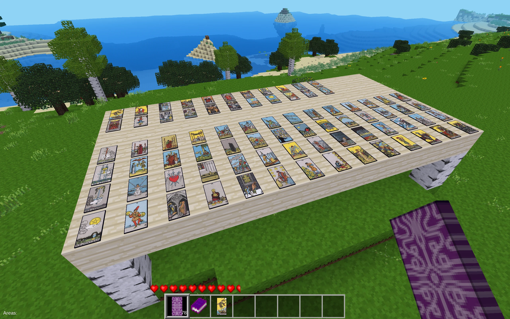
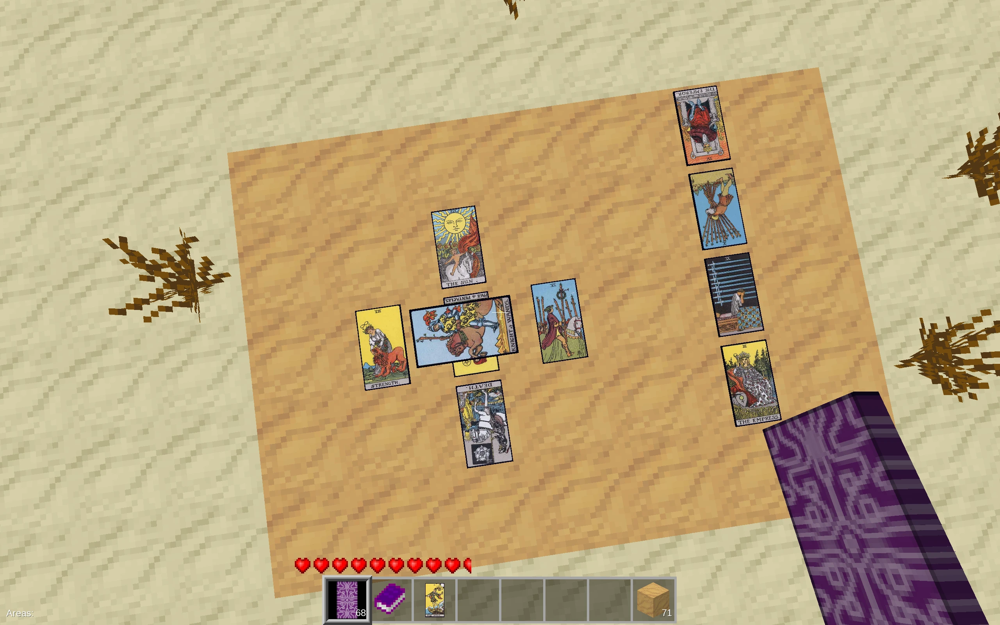

# Tarot Redo

This mod adds Tarot Cards in Luanti games.
Players can craft Tarot Cards, draw cards at random, and place cards on surfaces.
A Tarot Book item is also provided as a reference manual for the Tarot Cards.



This mod uses the famous Rider-Waite-Smith Tarot deck.

It is a fork of [APercy]'s [Tarot mod].
The main differences are:

-   This mod places Tarot Cards *in the world* as nodes,
    while the original mod can only use Tarot cards inside a dedicated window.
    This allows the player to use Tarot Cards as decoration on their walls or tables,
    or do Tarot readings for other players.
-   This mod lets the player decide where to place the Tarot Cards,
    while the original mod only supports two pre-defined spreads.
    This allows the player to use any spreads at their choice,
    as long as they build a sufficiently large table in the game.

[APercy]: https://content.luanti.org/users/apercy/
[Tarot mod]: https://content.luanti.org/packages/apercy/tarot/

# How to use

## Crafting the Tarot Cards

In Minetest Game, you can craft a deck of 78 Tarot Cards using the following recipe:

```
Red Dye    | Green Dye | Paper
Yellow Dye | Paper     | Black Dye
Paper      | Blue Dye  | Violet Dye
```

Mineclonia and VoxeLibre give some dyes different names:

| Minetest Game | Mineclonia   | VoxeLibre  |
|---------------|--------------|------------|
| Red Dye       | Red Dye      | Red Dye    |
| Yellow Dye    | Yellow Dye   | Yellow Dye |
| Green Dye     | Green Dye    | *Lime Dye* |
| Blue Dye      | Blue Dye     | Blue Dye   |
| Violet Dye    | *Purple Dye* | Violet Dye |
| Black Dye     | Black Dye    | Black Dye  |

## Drawing and placing Tarot Cards

The crafted Tarot Card items are un-revealed,
that is, you don't know which cards they are, yet.
They are shown as the purple card back icon.

You draw cards by placing (right-click) the cards on a solid surface,
horizontal or vertical, even ceilings.
Once placed, the un-revealed Tarot Card will turn into a random card.

You can take the revealed Tarot Cards back by holding an un-revealed tarot card in your hand,
and dig (left-click) a placed Tarot Card.
By doing so, the card becomes un-revealed again.

Alternatively, you can dig the placed Tarot Cards by hand or using swords.
Cards dug in this way remain revealed in your inventory,
and you can place them back to the world again.
Cards placed this way remain what they are, and won't become random cards.

### "Table" size

In the real world, a deck has 78 distinct cards, and you can't draw two identical cards.
In the game, it is hard to implement the idea of "a deck of distinct cards".
So when drawing cards in the game, we use the concept of "table" to de-duplicate cards.

A "table" is a contiguous flat surface where all blocks are the same.
For example:

-   All blocks are Apple Wood Planks.
-   All blocks are Obsidian Blocks.
-   All blocks are Glasses.
-   All blocks are Desert Cobblestones.

And they need to be connected to each other horizontally or vertically.

When you draw a card, the mod will search for all cards on the "table",
and make sure the newly drawn card is different from any cards on the "table".

By default, a table can be at most 26x26 blocks in size.
That is, when placing a card, the mod will search at most 25 blocks in all directions.
If the surface is larger than that, the mod will give you a warning,
and highlight the area where the mod looks for duplications.

So if you want to do Tarot card reading,
it is recommended to first craft a table with your favorite material,
and make sure it is large enough for your intended spread.

### Special notes for overlapping cards

Some spreads, such as the Celtic Cross, involves placing one card on top of another.
You can do this in the game, too.
Just place one card on top of another, and the new card will be 1 block above the old card.
That's because all cards are nodes, and each node occupies a 1x1x1 block.
It still looks nice if you look at the spread from above.

But note that if you place one card upon another,
the mod will consider the lower card as a 1x1 "table".
You may get card that is the same as another card on the actual "table".
One workaround is placing the card on the table first when drawing,
and then dig it with hand or sword, and place it on top of another card.



## The Tarot Book

In Minetest Game, you can craft a Tarot Book using the following recipe:

```
Red Dye    | Green Dye |
Yellow Dye | Book      | Black Dye
           | Blue Dye  | Violet Dye
```

In Mineclonia and VoxeLibre, refer to the table in the *Crafting the Tarot Cards* section.

### Highlighting the "table" area

While holding a Tarot Book item,
digging (left-clicking) a surface will highlight the area which the mod considers to be a "table".
That is the area where the mod de-duplicate drawn cards.

### The Tarot Book user interface (UI)

Right-click the book to open the Tarot Book UI.

Alternatively, use the chat command `/tarot_ui`.
It allows you to open the Tarot Book UI even without a Tarot Book item.

The UI lists all Tarot Cards in the Rider-Waite-Smith deck,
and show their meanings.

# Settings

## Server-side settings

The server can set the **de-duplication radius**,
i.e. the Chebyshev distance (max difference in X, Y and Z axes) to search for duplicated cards from the newly placed card.
Increasing the radius will allow larger tables,
but also increases the CPU usage when drawing a card.

## Per-player settings

There is also a "settings" section in the Tarot Book UI.
Open it using the Tarot Book item, or the chat command `/tarot_ui`.
Available options are:

-   Whether to use reversed cards
-   Whether to use all cards or Major Arcana only
-   Enable or disable the "table too large" warning

# Authors

Original mod developed by Alexsandro Percy (APercy).

Maintained by Kunshan Wang (wks).

Repository: https://github.com/wks/tarot/
